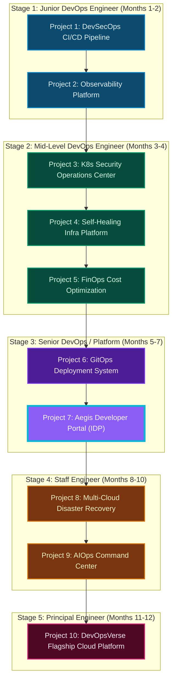

# 🌌 Aegis Internal Developer Platform (IDP)

[](http://192.168.49.2:30507)
[](https://kubernetes.io)
[](https://terraform.io)
[](https://argoproj.github.io/cd/)
[](https://keycloak.org)

Welcome to the **Aegis Internal Developer Platform (IDP)**. This is a production-grade, self-service platform engineering system designed to eliminate developer cognitive load. By implementing pre-approved **"Golden Paths"** (standard software templates), developers can provision namespaces, relational databases, cache instances, and Helm-packaged microservices with CI/CD configurations in seconds, without requiring direct DevOps intervention.

---

## 🎯 10-Stage DevOps Portfolio Roadmap

This platform represents **Project 7** in the DevOps and Platform Engineering progression, serving as the bridge to senior cloud architectures.



---

## 🏗️ Aegis IDP Architectural Topology

The diagram below maps how the Aegis developer console coordinates with Keycloak authentication, triggers Terraform workspaces, commits Helm configurations to a local GitOps loop, and triggers ArgoCD sync controllers to provision workloads inside the Kubernetes cluster.

```mermaid
graph TB
    Dev["Developer"]
    
    subgraph AegisSystem["Aegis IDP Platform (idp-system)"]
        Portal["Aegis Developer Portal (Flask Web Server)"]
        KC["Keycloak IAM Simulator"]
    end
    
    subgraph Engine["Provisioning & GitOps Engine"]
        TF["Terraform Engine (tf_utils)"]
        Git["Local GitOps Repository (git_utils)"]
    end
    
    subgraph ControlPlane["Kubernetes Control Plane"]
        Argo["ArgoCD Controller (argocd)"]
        K8sAPI["Kubernetes API Server"]
    end
    
    subgraph Namespaces["Tenant Infrastructure"]
        NS["Developer Namespaces (with Quotas)"]
        Pods["Application Workloads (Pods)"]
        DB["Database Pods (pg/redis)"]
    end

    Dev -->|1. Authenticates| KC
    Dev -->|2. Requests Infra (Use Golden Templates)| Portal
    Portal -->|3. Runs Terraform Pipeline| TF
    Portal -->|4. Scaffolds Helm Chart & Commits| Git
    TF -->|5. Creates Namespace & DB resources| K8sAPI
    K8sAPI -->|6. Provisions| NS
    Git -->|7. Webhook / Pull Sync| Argo
    Argo -->|8. Reconciles desired state| K8sAPI
    K8sAPI -->|9. Deploys workloads| Pods
    K8sAPI -->|10. Deploys persistent DB| DB
```

---

## ⚡ Core Platform Capabilities

### 1. **Software Catalog (Single Pane of Glass)**
* Provides unified visibility into active microservices, databases, Kubernetes namespaces, and pipeline templates.
* Tracks health status, pod specifications, namespaces, and author logs from a single interface.

### 2. **Golden Scaffolding Templates (Self-Service)**
* **Create Service**: Generates a standard Helm-packaged application, registers the CRD configuration with ArgoCD, and commits files to the GitOps repository.
* **Create Database**: Uses Terraform to spin up a persistent database container (`PostgreSQL` or `Redis`), automatically mounting volumes and injection secrets.
* **Create Namespace**: Provisions resource-constrained Kubernetes environments with custom CPU/Memory quotas (e.g. `2 cores / 4GiB limit`).
* **Create Pipeline**: Commits a clean CI/CD YAML configuration detailing linting, unit testing, SonarQube quality gates, and Trivy security sweeps.

### 3. **Keycloak Access Governance**
* Simulates realm authentication workflows, scope management, and OpenID Connect (OIDC) client configurations.
* Evaluates user groups and locks operational rights behind two security roles: `platform-admin` and `developer`.

---

## 📂 Project Repository Tree

```text
.
├── Dockerfile                  # Builds Python/Terraform/Kubectl container
├── README.md                   # Visual architecture and project details
├── app/                        # Flask application source directory
│   ├── git_utils.py            # Local Git template repository scaffolders
│   ├── gitops-templates/       # Boilderplate Helm and Kubernetes application files
│   ├── k8s_utils.py            # Client Kubernetes API & ArgoCD trigger hooks
│   ├── main.py                 # Flask server orchestrator and endpoints
│   ├── requirements.txt        # Python library dependencies
│   ├── static/                 # Frontend portal dashboards, CSS styles, JS data
│   │   ├── css/
│   │   │   └── style.css       # Glassmorphism dark layout & portfolio infographic style
│   │   ├── index.html          # Unified dashboard index file
│   │   ├── js/
│   │   │   └── app.js          # Interactive tabs controller and roadmap renderer
│   │   └── keycloak.html       # Simulated OIDC Keycloak Login form
│   └── tf_utils.py             # Terraform pipeline workspace runners
├── kubernetes/
│   └── idp-portal.yaml         # Kubernetes service account, RBAC rules, NodePort configurations
├── start.sh                    # Automation shell script to bootstrap local platform
├── stop.sh                     # Automation shell script to teardown all namespaces
└── terraform/
    ├── main.tf                 # Bootstraps ArgoCD Helm installation & namespaces
    ├── outputs.tf              # Returns Helm status and namespaces
    └── variables.tf            # Variables configuration
```

---

## 🚀 Getting Started

### Prerequisites
* A running **Minikube** cluster:
  ```bash
  minikube start --driver=docker --addons=ingress
  ```
* Local installations of `kubectl`, `terraform`, and `docker`.

### Bootstrapping the Platform
1. Run the initialization script to provision namespaces, compile the portal container, load the image into Minikube, and launch pods:
   ```bash
   chmod +x start.sh stop.sh
   ./start.sh
   ```

2. Once completed, the console output will print the target NodePort urls:
   ```text
   ======================================================================
         AEGIS INTERNAL DEVELOPER PLATFORM (IDP) BOOTSTRAP COMPLETE      
   ======================================================================
   Service Endpoints:
   1. Aegis Developer Portal
      - Access URL:  http://<minikube-ip>:30507
      - Login URL:   http://<minikube-ip>:30507/keycloak.html
      - SSO Account: admin / admin123
   2. ArgoCD Web Console
      - Access URL:  http://<minikube-ip>:30080
      - Credentials: admin / <auto-generated-password>
   ```

### Accessing via Port-Forwarding (Alternative)
If you cannot hit the Minikube IP directly, establish local tunnel proxies:
```bash
# Terminal 1: Port-forward Developer Portal
kubectl port-forward svc/idp-portal 5007:5007 -n idp-system

# Terminal 2: Port-forward ArgoCD API Server
kubectl port-forward svc/argocd-server 8080:80 -n argocd
```
You can then access the Portal at `http://localhost:5007/keycloak.html`.

---

## 🔬 Verification & Operational Command Reference

### Verify Pod Rollouts
```bash
kubectl get pods -n idp-system
kubectl get pods -n argocd
```

### Inspect Scaffolding Logs (Within Container)
When a developer launches a self-service template, you can trace Terraform runs and Git commits inside the container:
```bash
# Retrieve portal pod name
PORTAL_POD=$(kubectl get pods -n idp-system -l app=idp-portal -o jsonpath='{.items[0].metadata.name}')

# View scaffold logs directory
kubectl exec -it $PORTAL_POD -n idp-system -- ls -la /app/scaffold-logs/

# Stream logs of a running pipeline
kubectl logs -f $PORTAL_POD -n idp-system
```

### Teardown the Infrastructure
To destroy all provisioned microservices, namespaces, and clean ArgoCD Helm charts:
```bash
./stop.sh
```

---

## 👨‍💻 Developer SSO Demo Credentials

Use the following simulated Keycloak users to experience role-based restrictions inside the Aegis IDP portal:

| Username | Password | Assigned Role | Platform Capabilities |
| :--- | :--- | :--- | :--- |
| `admin` | `admin123` | `platform-admin` | Full Read/Write. Provision namespaces, databases, Helm services, and pipelines. |
| `devops` | `ops123` | `platform-admin` | Full Read/Write. System management and template optimization. |
| `developer` | `dev123` | `developer` | Limited Read-Only access to Catalog. Scaffolding actions are restricted. |
